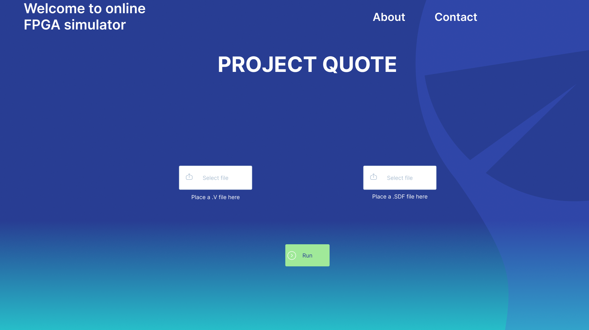
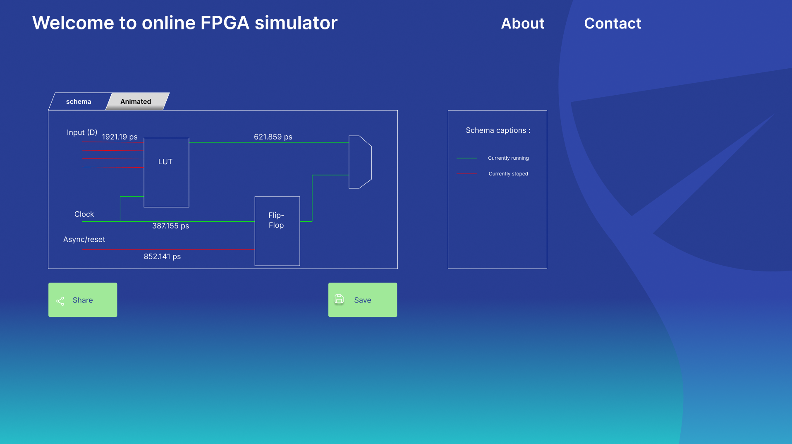

# Functional Specification

## Table of Contents
1. [Introduction](#1-introduction)
	1. [Purpose](#11-purpose)
	2. [Scope](#12-scope)
		1. [In Scope](#121-in-scope)
		2. [Out of Scope](#122-out-of-scope)
	3. [Definitions, Acronyms, and Abbreviations](#13-definitions-acronyms-and-abbreviations)
2. [Overall Description](#2-overall-description)
	1. [Stackholder](#21-stackholder)
	2. [Product Functions](#22-product-functions)
	3. [User Characteristics](#23-user-characteristics)
		1. [The teacher](#231-the-teacher)
		2. [The student](#232-the-student)
3. [Specific Requirements](#3-specific-requirements)
	1. [Functional Requirements](#31-functional-requirements)
		1. [Use Case](#311-use-case)
	2. [Non-Functional Requirements](#32-non-functional-requirements)
		1. [Quality Attributes](#321-quality-attributes)
	3. [Interface Requirements](#33-interface-requirements)
		1. [User Interface](#331-user-interface)
			1. [Home Page Mockup](#home-page-mockup)
			2. [Blueprint Page Mockup](#blueprint-page-mockup)
	4. [System Features](#34-system-features)
		1. [Input](#341-input)
			1. [Select .v and .sdf file](#3411-select-v-and-sdf-file)
			2. [Run](#3412-run)
			3. [Download](#3413-download)
			4. [Share](#3414-share)
			5. [Change preview](#3415-change-preview)
		2. [Output](#342-output)
			1. [The blueprint of the FPGA](#3421-the-blueprint-of-the-fpga)
			2. [The blueprint of the FPGA as a .png file](#3422-the-blueprint-of-the-fpga-as-a-png-file)
4. [Appendices](#4-appendices)
	1. [References](#41-references)

## 1. Introduction
### 1.1 Purpose

The project consists of creating a webpage that simulates the behaviour of an FPGA and outputs a blueprint of the FPGA with its components and connections from a .v and .sdf file. The document will describe the project's requirements, including the functional and non-functional requirements, the interfaces, and the system features.

### 1.2 Scope
 
#### 1.2.1 In Scope
The project includes:
- Webpage with a front end.
- Load the .v and .sdf files and output the blueprint of the FPGA.
- The blueprint could be animated or a schema with timelapse between each component.
- The blueprint could be downloaded or shared as a .png file.

#### 1.2.2 Out of Scope

The project excludes:
- An actual back end of the webpage.
- Implementing the .v and .sdf files directly from the webpage like an IDE.

### 1.3 Definitions, Acronyms, and Abbreviations

| Term | Backronym   | Definition |
| --- | --- | --- |
| FPGA | Field-Programmable Gate Array | A reconfigurable integrated circuit that consists of an array of programmable logic blocks and interconnects. Unlike fixed-function ASICs, FPGAs can be reprogrammed after manufacturing to perform specific logic functions, making them ideal for applications requiring flexibility, parallel processing, and hardware acceleration. |
| v | Verilog|A hardware description language (HDL) used to model, design, and simulate digital circuits. It enables engineers to describe the structure and behavior of electronic systems, making it essential for FPGA and ASIC development. Verilog supports design abstraction levels ranging from register-transfer level (RTL) to gate-level modeling.|
| sdf | Standard Delay Format  |A file format used in electronic design automation (EDA) to specify timing delays for digital circuits. SDF files contain detailed delay information, including path delays, setup and hold times, and clock-to-output delays, enabling accurate timing analysis and simulation of ASIC and FPGA designs.|
| PNG | Portable Network Graphics | A raster graphics file format that supports lossless data compression. PNG files are widely used on the web for images with transparent backgrounds, making them ideal for logos, icons, and other graphics that require crisp edges and smooth gradients.|
|IDE|Integrated Development Environment|A software application that provides comprehensive tools for software development, including code editing, debugging, testing, and deployment. IDEs are designed to streamline the development process, improve code quality, and enhance developer productivity.|
| Chromium | ... | An open-source web browser project that serves as the foundation for many popular browsers, including Google Chrome, Microsoft Edge, and Opera. Chromium provides a fast, secure, and stable browsing experience, with support for web standards and extensions.|
| Call of tender | ... | A formal invitation to bid on a project or contract, typically issued by a company or organization seeking proposals from qualified vendors. The call of tender outlines the project requirements, evaluation criteria, and submission deadlines, enabling vendors to submit competitive bids for consideration.|

## 2. Overall Description
### 2.1 Stackholder

| Stackholder | Description |
| --- | --- |
| Florent | The customer of the project. Give the call of tender. |
| Algosup | The school supervise the project and the different teams. |
| Team 2 | The group dedicated to the project. |

### 2.2 Product Functions
Summarize the major functions the product will perform.
The product will:
- Simulate an FPGA.
- Load a .v and .sdf file.
- Output a blueprint of the FPGA components and their connection between them.
- Download or share the blueprint as a .png file.

### 2.3 User Characteristics

#### 2.3.1 The teacher
The teacher will access the webpage, use this functionality, and share with the student to explain how the FPGA works.

#### 2.3.2 The student
The student during the teacher course will see the webpage and the teacher will explain how the FPGA works and simulate it.

## 3. Specific Requirements
### 3.1 Functional Requirements

#### 3.1.1 Use Case
| Use Case | Description |
| --- | --- |
| Load .v and .sdf file | The user will load the .v and .sdf file to the webpage. |
|Run| The webpage run the process to the blueprint generation |
| Output blueprint | The webpage will output the blueprint of the fpga. |
| Download| The user will can download the blueprint generated |
| Share | The user will can share the blueprint generated |
| Change preview | The blueprint could be fix schema, animated and get timelapse between components according to the user choice via buttons |

### 3.2 Non-Functional Requirements
#### 3.2.1 Quality Attributes
- The webpage should be easy to use and intuitive.
- The webpage has been used for educational purposes.
- The webpage is mainly designed for Chromium-based browsers.
- The webpage should be responsive for a pc or laptop.

### 3.3 Interface Requirements

#### 3.3.1 User Interface

##### Home Page Mockup

##### Blueprint Page Mockup

### 3.4 System Features

#### 3.4.1 Input
The user has used some button to perform the following actions:

##### 3.4.1.1 Select .v and .sdf file
User can either drag and drop the .v and .sdf file or click on the button to select the file.

##### 3.4.1.2 Run
User can run the process to generate the blueprint of the FPGA.

##### 3.4.1.3 Download
User can download the blueprint of the FPGA as a .png file.

##### 3.4.1.4 Share
User can share the blueprint of the FPGA.

##### 3.4.1.5 Change preview
User can change the preview of the blueprint (animated, schema).

#### 3.4.2 Output

##### 3.4.2.1 The blueprint of the FPGA
The webpage will output the blueprint of the FPGA with its components and connections.

##### 3.4.2.2 The blueprint of the FPGA as a .png file
The user can download or share the blueprint of the FPGA as a .png file.

## 4. Appendices

### 4.1 References

- [FPGA](https://en.wikipedia.org/wiki/Field-programmable_gate_array)
- [Verilog](https://en.wikipedia.org/wiki/Verilog)
- [Standard Delay Format](https://en.wikipedia.org/wiki/Standard_Delay_Format)
- [PNG](https://en.wikipedia.org/wiki/Portable_Network_Graphics)
- [Chromium](https://www.chromium.org/Home)
- [Call of tender](https://github.com/LeFl0w/ALGOSUP_POC)

